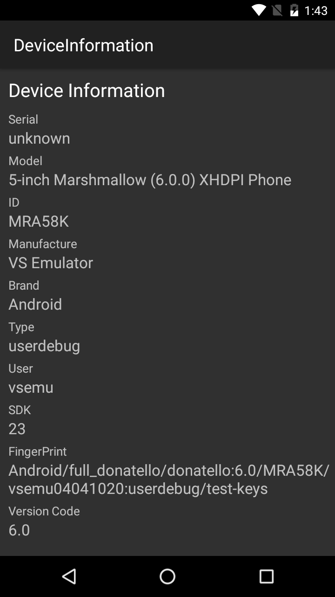

## Code

```
txtSerial.Text = Build.Serial.ToString();
txtModel.Text = Build.Model.ToString();
txtID.Text = Build.Id.ToString();
txtManufacture.Text = Build.Manufacturer.ToString();
txtBrand.Text = Build.Brand.ToString();
txtType.Text = Build.Type.ToString();
txtUser.Text = Build.User.ToString();
txtSdk.Text = Build.VERSION.Sdk.ToString();
txtFingerPrint.Text = Build.Fingerprint.ToString();
txtVersionCode.Text = Build.VERSION.Release.ToString();
```


